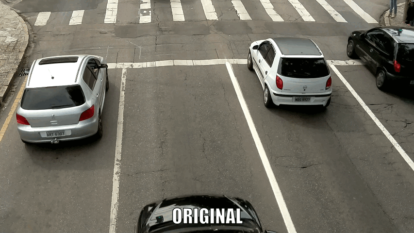
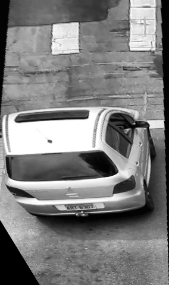
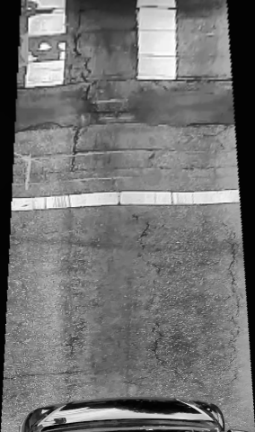
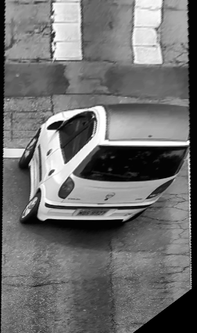
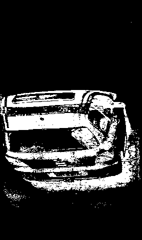
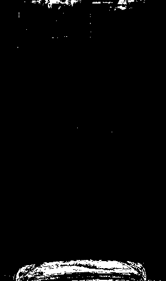
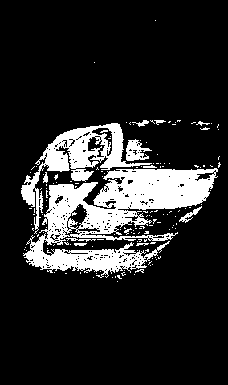
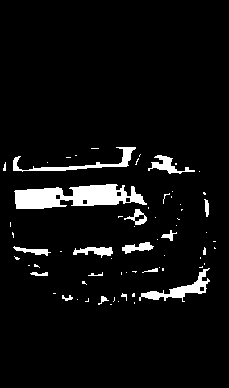
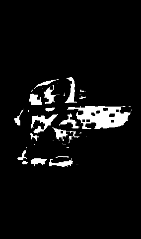
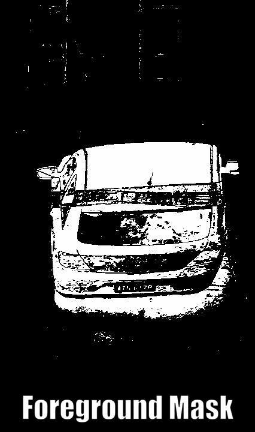

# SpeedTCC

## How it works

## Image Pre-processing



## Image processing

The next steps can be performed independently. From now on, we work with three images, one for each track/lane.

### Apply new Perspective

Applying a new perspective to linearize object detection. It makes tracking and speed calculation easier and more reliable.

<p float="middle">
   
   
  
</p>

### Apply Foreground Mask

Apply Foreground Mask to highlight pixels that have changed from previous frames.

<p>
  
   
  
</p>

### Apply Eroded Mask

Apply Eroded Mask to remove noise.

<p>
  
   
  
</p>

### Apply Dilated Mask

Apply Dilated Mask to highlight the vehicle/object

<p>
  
   
  
</p>

### Apply Convex Hull

Apply convex hull to smooth edges.

<p>
  
   
  
</p>

### GIF to ilustrate



### Calculate the speed

In order to calculate the vehicle speed we use the center points and frame quantity.

---

## Installing

```sh
git clone https://github.com/brochj/SpeedTCC.git
cd SpeedTCC
```

#### 1. Create a virtual environment

```sh
python -m venv .venv
```

#### 2. Activate the virtual environment

##### On Linux or MacOs, using bash

```sh
source .venv/bin/activate
```

##### On Windows using the Command Prompt:

```sh
.venv\Scripts\activate.bat
```

##### On Windows using PowerShell:

```sh
.venv\Scripts\Activate.ps1
```

#### 3. Installing the dependencies

```sh
pip install -r requirements.txt
```

#### 4. Download the Videos
